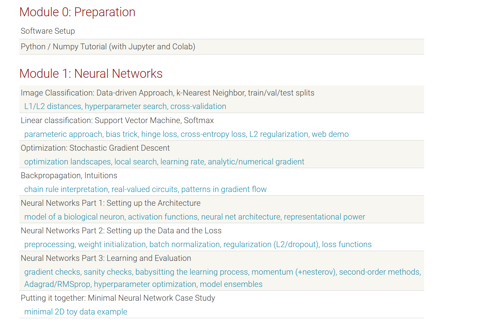
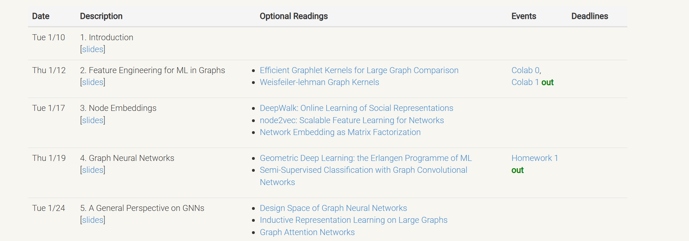
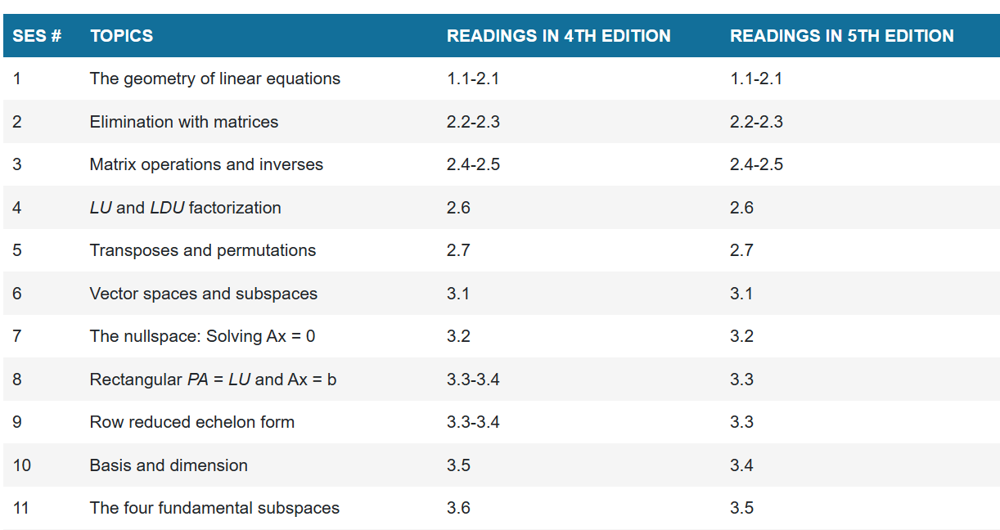

# 6.16 review

## 神经网络基础

通过[cs231n]([CS231n Convolutional Neural Networks for Visual Recognition](https://cs231n.github.io/))课程, 目前已经对训练一个全连接层网络步原理以及步骤有了基本的了解, 主要包括:

+ 数据预处理
+ 前向以及反向传播
+ 正则化方法
+ 梯度更新相关算法

## 学习材料

1. 学习课程的视频以及 [note](https://cs231n.github.io/) **目前已经完成 module1**

2. 课程作业完成**assignment1** [being12345/cs231n: cs231n (github.com)](https://github.com/being12345/cs231n) --  使用 numpy 手写一个二层神经网络

## 图机器学习

看了相关图机器学习综述

学习图机器学习库 networkx, [并且代码实践](https://github.com/being12345/cs224w)

学习图机器学习特征工程: 节点工程, 边工程, 全图工程(人工)方法

### 相关材料

1. [综述](https://distill.pub/2021/gnn-intro/)(没有代码比较空泛)
2. networkx库代码视频学习
3. 相关理论学习至[2](http://web.stanford.edu/class/cs224w/)

### 计划

1. 继续相关理论学习阅读经典 paper
2. 实践 paper 中的代码熟悉图机器学习编程 

## 线性代数

复习至**vector space**

### 学习材料

1. 学习 [MIT 18.06 strang 课程](https://ocw.mit.edu/courses/18-06-linear-algebra-spring-2010/pages/related-resources/) 以及[阅读相关教材至11](https://ocw.mit.edu/courses/18-06-linear-algebra-spring-2010/pages/readings/)

## 矩阵微积分

学习了梯度的求法对于经典函数例如 softmax sigmoid WX 做了推导

### 学习材料

1. [being12345/matrix_calculus: This is including most useful matrix calculus material (github.com)](https://github.com/being12345/matrix_calculus)